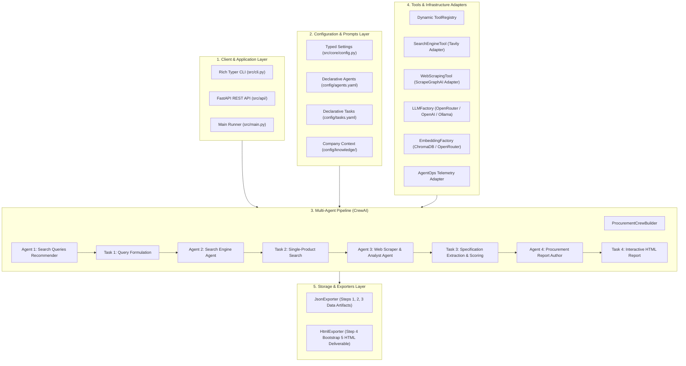

# Enterprise Multi-Agent Procurement Intelligence System

[](https://www.python.org/downloads/release/python-3120/)
[](https://crewai.com)
[](https://fastapi.tiangolo.com)
[](LICENSE)
[](tests/)

An enterprise-grade, production-ready **Multi-Agent Procurement Intelligence System** built with **CrewAI**. The system automates the complete end-to-end procurement research lifecycle: intelligent search query formulation, single-product search filtering, deep web scraping, structured specification extraction, multi-product ranking, and executive Bootstrap HTML procurement report authoring.

---

## System Architecture



---

## Applied Design Patterns Matrix

| Design Pattern | Architectural Purpose | Code Implementation |
| :--- | :--- | :--- |
| **Factory Pattern** | Object creation & decoupling | `LLMFactory`, `EmbeddingFactory`, `AgentFactory`, `TaskFactory` |
| **Strategy Pattern** | Interchangeable algorithms/providers | `BaseSearchClient` (Tavily/Mock), `BaseScraperClient` (ScrapeGraphAI/Mock), `BaseExporter` (JSON/HTML/S3) |
| **Adapter Pattern** | 3rd-party library isolation | `TavilySearchClientAdapter`, `ScrapeGraphClientAdapter`, `AgentOpsManager` |
| **Builder Pattern** | Dynamic pipeline construction | `ProcurementCrewBuilder` assembling agents, tasks, knowledge, and process |
| **Registry Pattern** | Extensible tool discovery | `ToolRegistry` enabling plugin-style tool addition without modifying orchestrators |
| **Template Method Pattern** | Standardized workflow execution | `BaseCrew` managing `pre_run()`, `post_run()`, error traps, and telemetry |

---

## Project Structure

```
abubakr-crewai/
├── .env.example                     # Environment variables template
├── .gitignore                       # Git ignore rules
├── Dockerfile                       # Production container build
├── docker-compose.yml               # Service orchestration
├── pyproject.toml / requirements.txt# Pinned production dependencies
├── README.md                        # Project documentation
├── Makefile                         # Developer command shortcuts
├── plan.md                          # Comprehensive architectural plan
├── walkthrough.md                   # Step-by-step transformation walkthrough
│
├── config/                          # Declarative Prompts & Configurations
│   ├── agents.yaml                  # Agent roles, goals, backstories, and tools
│   ├── tasks.yaml                   # Task descriptions, outputs, and schema mappings
│   └── knowledge/                   # Static domain knowledge assets
│       └── company_context.txt      # Target company profile and purchasing rules
│
├── src/                             # Application Source Code
│   ├── __init__.py
│   ├── main.py                      # Main entrypoint executing default workflow
│   ├── cli.py                       # Rich Typer CLI interface
│   │
│   ├── core/                        # Core Infrastructure
│   │   ├── config.py                # Pydantic Settings & typed environment manager
│   │   ├── logging.py               # Centralized Loguru structured logging
│   │   └── exceptions.py            # Domain exception hierarchy
│   │
│   ├── domain/                      # Domain Entities & Pydantic DTOs
│   │   ├── search.py                # SuggestedSearchQueries, AllSearchResults
│   │   ├── product.py               # ProductSpec, SingleExtractedProduct, AllExtractedProducts
│   │   └── procurement.py           # ProcurementInput, ProcurementResult, ExecutionMetrics
│   │
│   ├── infrastructure/              # External Integrations & Adapters
│   │   ├── llm/                     # LLMFactory & Provider Strategies
│   │   ├── embeddings/              # EmbeddingFactory for Vector Search
│   │   ├── clients/                 # Tavily & ScrapeGraphAI Client Adapters
│   │   └── telemetry/               # AgentOps Session Lifecycle Manager
│   │
│   ├── tools/                       # Extensible CrewAI Tools
│   │   ├── base.py                  # BaseProcurementTool with safe execution wrapper
│   │   ├── registry.py              # Dynamic ToolRegistry
│   │   ├── search_tool.py           # SearchEngineTool
│   │   └── scraper_tool.py          # WebScrapingTool with dynamic schema injection
│   │
│   ├── knowledge/                   # Knowledge Base Loaders
│   │   └── loader.py                # KnowledgeLoader
│   │
│   ├── agents/                      # Agent Factory
│   │   └── factory.py               # AgentFactory
│   │
│   ├── tasks/                       # Task Factory
│   │   └── factory.py               # TaskFactory
│   │
│   ├── crews/                       # Multi-Agent Workflow Orchestration
│   │   ├── base.py                  # BaseCrew lifecycle template
│   │   ├── builder.py               # ProcurementCrewBuilder
│   │   └── procurement_crew.py      # ProcurementCrew pipeline runner
│   │
│   ├── exporters/                   # Artifact Storage & Exporters
│   │   ├── base.py                  # BaseExporter
│   │   ├── json_exporter.py         # JsonExporter
│   │   └── html_exporter.py         # HtmlExporter with code-fence stripping
│   │
│   └── api/                         # Production REST API (FastAPI)
│       ├── app.py                   # FastAPI application factory
│       ├── routes.py                # REST endpoints (/procure, /health, /tools, /reports)
│       └── schemas.py               # API request/response models
│
└── tests/                           # Automated Pytest Suite
    ├── conftest.py                  # Shared fixtures & test doubles
    ├── unit/                        # Unit tests (config, schemas, llm, tools, builder)
    └── integration/                 # Integration tests (api, pipeline)
```

---

## Quickstart Guide

### 1. Prerequisites
- **Python**: `>= 3.12`
- **Package Manager**: [`uv`](https://github.com/astral-sh/uv) (Recommended) or `pip`

### 2. Installation with `uv`
```bash
# Create virtual environment with Python 3.12
uv venv .venv --python 3.12

# Activate environment
source .venv/bin/activate

# Install all dependencies
uv pip install -r requirements.txt
```

### 3. Environment Configuration
Copy `.env.example` to `.env` and supply your API keys:
```bash
cp .env.example .env
```
Key environment variables in `.env`:
```ini
LLM_PROVIDER=openrouter
LLM_MODEL=openrouter/stealth/ox-alpha
OPENROUTER_API_KEY=your_openrouter_key
TAVILY_API_KEY=your_tavily_key
SCRAPEGRAPH_API_KEY=your_scrapegraph_key
AGENTOPS_ENABLED=true
AGENTOPS_API_KEY=your_agentops_key
OUTPUT_DIR=./outputs
```

---

## Usage & Interfaces

### 1. Run via CLI (Interactive)
```bash
# Validate configuration and API keys
python -m src.cli validate-config

# List available tools
python -m src.cli list-tools

# Run workflow with default parameters
python -m src.cli run

# Run workflow with custom parameters
python -m src.cli run \
  --product "ergonomic executive desk" \
  --country "Egypt" \
  --websites "www.amazon.eg,www.jumia.com.eg,www.noon.com/egypt-en" \
  --keywords 10 \
  --top-n 15 \
  --score-th 0.35 \
  --output-dir "./outputs"
```

### 2. Run via Main Python Script
```bash
python -m src.main
```

### 3. Run via REST API (FastAPI)
Start the REST API server:
```bash
uvicorn src.api.app:app --host 0.0.0.0 --port 8000 --reload
```
- **Interactive Swagger Docs**: `http://localhost:8000/docs`
- **Health Endpoint**: `GET http://localhost:8000/api/v1/health`
- **Trigger Procurement Run**:
  ```bash
  curl -X POST "http://localhost:8000/api/v1/procure" \
       -H "Content-Type: application/json" \
       -d '{
         "product_name": "coffee machine for office",
         "websites_list": ["www.amazon.eg", "www.jumia.com.eg", "www.noon.com/egypt-en"],
         "country_name": "Egypt",
         "no_keywords": 10,
         "top_recommendations_no": 15
       }'
  ```

---

## Testing & Quality Assurance

Run the automated test suite with pytest:
```bash
pytest -v tests/
```
All **19 unit and integration tests** run isolated with mock adapters and zero remote network requirements.

---

## Docker Deployment

### Run with Docker Compose:
```bash
# Build and start the container in background
docker compose up -d

# View real-time logs
docker compose logs -f

# Stop the service
docker compose down
```

---

## Extensibility Guide

### Adding a New Tool
1. Create your tool class subclassing `BaseProcurementTool` in `src/tools/my_tool.py`:
   ```python
   from src.tools.base import BaseProcurementTool
   from pydantic import BaseModel, Field

   class MyInputSchema(BaseModel):
       item: str = Field(...)

   class MyCustomTool(BaseProcurementTool):
       name: str = "my_custom_tool"
       description: str = "Does something helpful"
       args_schema: type[BaseModel] = MyInputSchema

       def _run(self, item: str):
           return {"result": "processed"}
   ```
2. Register it in `ToolRegistry` or assign its name `"my_custom_tool"` in `config/agents.yaml`.

### Adding a New Agent & Task
1. Add the declarative agent definition in `config/agents.yaml`.
2. Add the declarative task definition in `config/tasks.yaml`.
3. `AgentFactory` and `TaskFactory` will automatically parse and bind them at runtime with zero orchestrator code modifications.

---

## License
This project is licensed under the MIT License.
