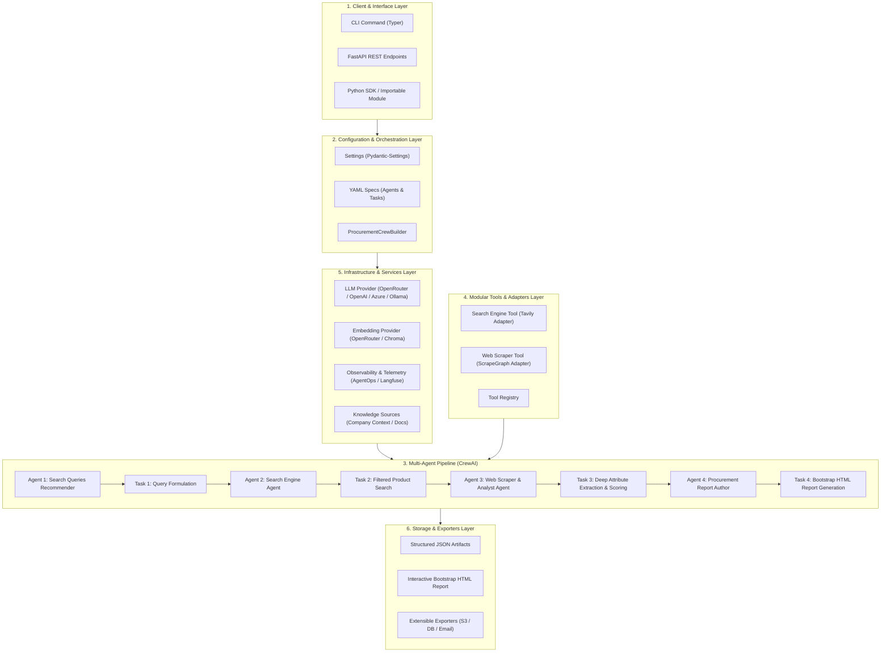

# 🏛️ Architectural Design Plan: Enterprise Multi-Agent Procurement System (CrewAI)

## 1. Executive Summary & Vision
This document presents the complete architectural blueprint to transform the experimental Jupyter Notebook (`crewai_abubakr.ipynb`) into an **enterprise-grade, modular, decoupled, and production-ready Multi-Agent Procurement Intelligence System**.

The target system is designed using clean software architecture principles (Domain-Driven Design, Hexagonal/Ports & Adapters, and SOLID principles) alongside battle-tested Gang of Four (GoF) design patterns to ensure:
- **Zero Hardcoding**: 100% configuration-driven agents, tasks, and system parameters via YAML and typed environment settings.
- **Maximum Modularity**: Every component (LLMs, Tools, Knowledge Sources, Agents, Tasks, Exporters) is isolated behind clean interfaces and abstract base classes.
- **Effortless Extensibility**: Adding a new agent (e.g., *Budget Analyst*, *Supplier Verifier*), swapping search engines (e.g., from *Tavily* to *SerpAPI* or *Bing*), changing scrapers (from *ScrapeGraphAI* to *Firecrawl* or *Playwright*), or adding output destinations (Slack, S3, Email) requires implementing a single adapter class without modifying core business logic.
- **Production Readiness**: Structured logging, observability (AgentOps / OpenTelemetry / Langfuse), robust error handling, retries, input/output validation via Pydantic V2, CLI & FastAPI interfaces, and Docker containerization.

---

## 2. Applied Design Patterns Matrix

| Pattern | Architectural Role | Implementation in Project |
| :--- | :--- | :--- |
| **Factory Pattern** (`Factory Method` & `Abstract Factory`) | Object Creation & Lifecycle | `LLMFactory`, `EmbeddingFactory`, `AgentFactory`, `TaskFactory`, `ToolFactory` |
| **Strategy Pattern** | Interchangeable Algorithms & Providers | Swappable Search Providers (`TavilyStrategy`, `SerpApiStrategy`), Scraping Providers (`ScrapeGraphStrategy`, `PlaywrightStrategy`), Storage/Exporters (`HtmlExporter`, `JsonExporter`, `S3Exporter`) |
| **Adapter Pattern (Ports & Adapters)** | External Service Decoupling | Wrapping 3rd-party libraries (`TavilyClient`, `ScrapeGraphAI`, `AgentOps`, `OpenRouter`) in application-level interfaces |
| **Builder Pattern** | Complex Object Construction | `ProcurementCrewBuilder` to dynamically assemble custom crews, pipelines, tasks, and process modes (sequential or hierarchical) |
| **Registry Pattern** | Dynamic Discovery & Extension | `ToolRegistry`, `AgentRegistry`, `KnowledgeRegistry` allowing plugin-style additions without modifying orchestrators |
| **Template Method Pattern** | Workflow Standardization | `BasePipelineRunner` defining standard execution hooks: `pre_execution()`, `validate_inputs()`, `execute()`, `post_process()`, `export_artifacts()` |
| **Observer / Callback Pattern** | Telemetry & Lifecycle Events | CrewAI step callbacks, event dispatchers for logging, progress reporting, and metric emission (AgentOps / custom hooks) |
| **Repository / Data Access Pattern** | Knowledge & Persistence | `KnowledgeRepository` for company documents and domain catalogs, `ArtifactRepository` for saving run outputs |

---

## 3. High-Level Architecture & Communication Flow



---

## 4. Detailed Component Communication Flow

1. **Initialization Phase**:
   - User triggers pipeline via CLI (`python -m src.cli run --product "coffee machine for office"`) or API request.
   - `Settings` loads environment variables from `.env` and validates required API keys.
   - `LLMFactory` instantiates the configured LLM instance (OpenRouter, OpenAI, etc.).
   - `EmbeddingFactory` prepares the knowledge base embedder.
   - `AgentOps` / Telemetry service initializes session tracking.

2. **Assembly Phase (`Builder Pattern`)**:
   - `ProcurementCrewBuilder` reads agent and task definitions from `config/agents.yaml` and `config/tasks.yaml`.
   - Dynamic prompt variables (e.g. `{product_name}`, `{websites_list}`, `{country_name}`, `{score_th}`) are injected.
   - Tools are retrieved from `ToolRegistry` and bound to their respective agents.
   - Knowledge sources (`CompanyContext`) are loaded from `config/knowledge/` and attached to the Crew.

3. **Execution Phase (`Sequential / Hierarchical Pipeline`)**:
   - **Step 1 (Query Recommendation)**: Agent 1 analyzes the procurement request against company context and generates a structured list of site-targeted search queries (`SuggestedSearchQueries`).
   - **Step 2 (Single-Product Search)**: Agent 2 invokes `SearchTool`, executes queries against Tavily, filters out category/listing pages, enforces score thresholds, and outputs `AllSearchResults`.
   - **Step 3 (Deep Web Scraping & Analysis)**: Agent 3 invokes `ScrapeTool` (powered by ScrapeGraphAI), extracts rich product specs (prices, availability, features), evaluates and ranks candidates, producing `AllExtractedProducts`.
   - **Step 4 (Executive Report Generation)**: Agent 4 synthesizes extracted data, company context, and price comparisons into an executive-grade HTML report styled with Bootstrap 5 and Chart.js.

4. **Export & Persistence Phase**:
   - Artifacts (`step_1_suggested_search_queries.json`, `step_2_search_results.json`, `step_3_search_results.json`, `step_4_procurement_report.html`) are written to the configured output directory via `ArtifactExporter`.
   - Telemetry session is cleanly closed.

---

## 5. Complete Production Directory & File Structure

```
abubakr-crewai/
├── .env.example                     # Environment variables template
├── .gitignore                       # Git ignore rules for Python, outputs, and keys
├── Dockerfile                       # Container definition for production deployment
├── docker-compose.yml               # Local orchestration with monitoring/services
├── pyproject.toml                   # Modern Python project configuration (PEP 518/621)
├── requirements.txt                 # Pinned dependencies
├── README.md                        # Documentation, architecture guide & quickstart
├── Makefile                         # Dev shortcuts (run, test, lint, format, docker)
├── plan.md                          # Architecture design plan (this document)
│
├── config/                          # Configuration & Prompt Assets (Zero hardcoding)
│   ├── agents.yaml                  # Declarative agent roles, goals, and backstories
│   ├── tasks.yaml                   # Declarative task descriptions and expected outputs
│   └── knowledge/                   # Static knowledge files (text, markdown, pdf)
│       └── company_context.txt      # Company profile & procurement rules
│
├── src/                             # Core Application Source Code
│   ├── __init__.py
│   ├── main.py                      # Main application execution entrypoint
│   ├── cli.py                       # Rich CLI interface (Typer / Argparse)
│   │
│   ├── core/                        # Core configuration and system contracts
│   │   ├── __init__.py
│   │   ├── config.py                # Pydantic Settings & environment validation
│   │   ├── exceptions.py            # Custom domain exception hierarchy
│   │   └── logging.py               # Centralized structured logging setup
│   │
│   ├── domain/                      # Domain Entities, DTOs & Pydantic Schemas
│   │   ├── __init__.py
│   │   ├── search.py                # SuggestedSearchQueries, SearchResult schemas
│   │   ├── product.py               # ProductSpec, SingleExtractedProduct, AllExtractedProducts
│   │   └── procurement.py           # ProcurementInput, ProcurementSummary schemas
│   │
│   ├── infrastructure/              # External Integrations & Service Adapters (Ports & Adapters)
│   │   ├── __init__.py
│   │   ├── llm/                     # LLM Provider Factory & Adapters
│   │   │   ├── __init__.py
│   │   │   ├── base.py              # Base LLM provider interface
│   │   │   └── factory.py           # LLMFactory (OpenRouter, OpenAI, Ollama, etc.)
│   │   ├── embeddings/              # Embedding Factory for Chroma / Knowledge
│   │   │   ├── __init__.py
│   │   │   └── factory.py           # EmbeddingFactory
│   │   ├── clients/                 # Low-level external client wrappers
│   │   │   ├── __init__.py
│   │   │   ├── tavily_client.py     # Tavily search client adapter with retries
│   │   │   └── scrapegraph_client.py # ScrapeGraphAI client adapter
│   │   └── telemetry/               # Observability & Tracing (AgentOps, etc.)
│   │       ├── __init__.py
│   │       └── agentops_adapter.py  # AgentOps lifecycle manager
│   │
│   ├── tools/                       # Reusable & Extensible CrewAI Tools
│   │   ├── __init__.py
│   │   ├── base.py                  # Base tool definition & error handler
│   │   ├── registry.py              # Dynamic ToolRegistry (Register, Discover, Inject)
│   │   ├── search_tool.py           # SearchEngineTool implementation
│   │   └── scraper_tool.py          # WebScrapingTool implementation
│   │
│   ├── knowledge/                   # Knowledge Base Management
│   │   ├── __init__.py
│   │   └── loader.py                # KnowledgeSourceLoader (String, File, Directory)
│   │
│   ├── agents/                      # Agent Factories & Definitions
│   │   ├── __init__.py
│   │   └── factory.py               # AgentFactory (instantiates agents from YAML & DI)
│   │
│   ├── tasks/                       # Task Factories & Output Schema Mapping
│   │   ├── __init__.py
│   │   └── factory.py               # TaskFactory (instantiates tasks from YAML & DI)
│   │
│   ├── crews/                       # Crew Orchestration & Workflow Pipelines
│   │   ├── __init__.py
│   │   ├── base.py                  # BaseCrew abstract class & lifecycle hooks
│   │   ├── builder.py               # ProcurementCrewBuilder (Builder Pattern)
│   │   └── procurement_crew.py      # ProcurementCrew pipeline execution engine
│   │
│   ├── exporters/                   # Artifact Storage & Exporters (Strategy Pattern)
│   │   ├── __init__.py
│   │   ├── base.py                  # BaseExporter interface
│   │   ├── json_exporter.py         # JSON artifact writer
│   │   └── html_exporter.py         # HTML report writer & validator
│   │
│   └── api/                         # Production REST API (FastAPI)
│       ├── __init__.py
│       ├── app.py                   # FastAPI application factory
│       ├── routes.py                # Endpoints (/procure, /health, /runs/{id})
│       └── schemas.py               # API request/response models
│
├── tests/                           # Automated Test Suite (Unit & Integration)
│   ├── __init__.py
│   ├── conftest.py                  # Pytest fixtures & mock objects
│   ├── unit/                        # Unit tests (isolated with mocks)
│   │   ├── test_config.py
│   │   ├── test_schemas.py
│   │   ├── test_llm_factory.py
│   │   ├── test_tools.py
│   │   └── test_crew_builder.py
│   └── integration/                 # End-to-end integration tests
│       └── test_pipeline.py
│
└── outputs/                         # Default directory for generated artifacts
    └── .gitkeep
```

---

## 6. How the Components Communicate & Why This Architecture Excels

### 1. Separation of Concerns (Configuration vs Code)
- In the notebook, prompts and agent definitions are hardcoded inside Python strings.
- In this architecture, all prompts, goals, and backstories live in `config/agents.yaml` and `config/tasks.yaml`. Prompts can be updated, translated, or A/B tested without touching a single line of Python code.

### 2. Dependency Injection & Inversion of Control
- `AgentFactory` and `TaskFactory` don't hardcode specific LLM instances or tools. Instead, instances of `LLM`, `ToolRegistry`, and `KnowledgeSource` are injected at runtime.
- You can seamlessly run the crew in test mode with a mock LLM or lightweight model, and in production with high-grade models.

### 3. Replaceable & Extensible Tooling (`Registry Pattern`)
- `ToolRegistry` allows dynamic tool registration. If you want to replace ScrapeGraphAI with a custom Playwright or Firecrawl scraper, you simply create `PlaywrightScraperTool` implementing `BaseTool`, register it in the registry, and reference its name in `tasks.yaml`.

### 4. Pluggable Output Exporters (`Strategy Pattern`)
- After CrewAI completes execution, outputs are dispatched to registered `BaseExporter` instances. You can save to disk (`JsonExporter`, `HtmlExporter`), send an alert to Slack, or upload reports directly to an AWS S3 bucket.

### 5. Multi-Interface Accessibility
- **CLI**: Fast interactive runs via terminal with rich progress bars and parameter flags.
- **REST API**: Production-ready FastAPI service allowing web applications, cron jobs, or microservices to trigger procurement runs asynchronously.
- **Python SDK**: Importable as a clean library:
  ```python
  from src.crews.procurement_crew import ProcurementCrew
  from src.domain.procurement import ProcurementInput

  crew = ProcurementCrew()
  report = crew.run(ProcurementInput(product_name="espresso machine"))
  ```

---

## 7. Implementation Roadmap & Steps

1. **Step 1**: Initialize project configuration, dependency management (`pyproject.toml`, `requirements.txt`, `.env.example`).
2. **Step 2**: Create domain models & Pydantic schemas (`src/domain/`).
3. **Step 3**: Build core infrastructure: configuration manager (`src/core/config.py`), logging (`src/core/logging.py`), and custom exceptions.
4. **Step 4**: Build infrastructure factories (LLM factory, Embedding factory, external client adapters for Tavily, ScrapeGraphAI, AgentOps).
5. **Step 5**: Implement tool layer and `ToolRegistry` (`src/tools/`).
6. **Step 6**: Implement YAML configuration files (`config/agents.yaml`, `config/tasks.yaml`, `config/knowledge/`).
7. **Step 7**: Build `AgentFactory`, `TaskFactory`, and `ProcurementCrewBuilder` (`src/agents/`, `src/tasks/`, `src/crews/`).
8. **Step 8**: Implement artifact exporters (`src/exporters/`).
9. **Step 9**: Implement user interfaces: CLI (`src/cli.py`), Main runner (`src/main.py`), and REST API (`src/api/`).
10. **Step 10**: Write comprehensive unit tests and verification suite (`tests/`).
