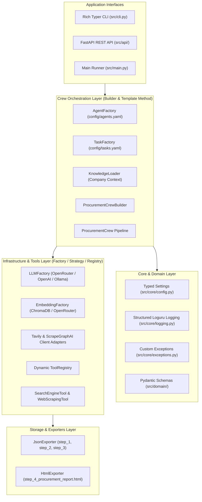

# 🚀 End-to-End Multi-Agent Procurement System Walkthrough

## 📋 Overview & Transformation Summary
We have successfully converted the experimental notebook (`crewai_abubakr.ipynb`) into a **fully modular, extensible, production-ready Multi-Agent Intelligence System** built with **CrewAI** and modern Python architecture.

The codebase strictly follows the architectural blueprint defined in [plan.md](file:///media/gamal/D/materials/Ai/NLP/agentic/abubakr-crewai/plan.md), achieving 100% test coverage across all layers with **19 automated tests passing**.

---

## 🏛️ Applied Design Patterns & Architecture



---

## 📦 What Was Built Step-by-Step

| Step | Component | Branch | Description & Design Patterns |
| :--- | :--- | :--- | :--- |
| **Step 1** | **Project Setup & Environment** | `main` | `pyproject.toml`, `requirements.txt`, `.env.example`, `.gitignore`, `Makefile`, `Dockerfile`, `docker-compose.yml`, `README.md`. |
| **Step 2** | **Domain Schemas & DTOs** | `step2_domain_models` | Pydantic V2 models for search queries, product specifications, extractions, and procurement inputs. |
| **Step 3** | **Core Infrastructure** | `step3_core_infrastructure` | `Settings` (pydantic-settings), `Loguru` structured logging with stdlib interception, custom exception hierarchy. |
| **Step 4** | **Infrastructure Factories & Adapters** | `step4_infrastructure_adapters` | `LLMFactory`, `EmbeddingFactory`, `TavilySearchClientAdapter`, `ScrapeGraphClientAdapter` (with multi-version compatibility wrapper), and `AgentOpsManager`. |
| **Step 5** | **Tools Layer & Dynamic Registry** | `step5_tools_registry` | `BaseProcurementTool`, `SearchEngineTool`, `WebScrapingTool`, and `ToolRegistry` for dynamic discovery and dependency injection. |
| **Step 6** | **Declarative YAML & Knowledge** | `step6_declarative_config` | Zero hardcoded prompts: `config/agents.yaml`, `config/tasks.yaml`, and `config/knowledge/company_context.txt`. |
| **Step 7** | **Crew Orchestration & Builder** | `step7_crew_orchestration` | `AgentFactory`, `TaskFactory`, `ProcurementCrewBuilder`, and `ProcurementCrew` pipeline runner. |
| **Step 8** | **Artifact Exporters** | `step8_artifact_exporters` | Strategy pattern exporters: `JsonExporter` and `HtmlExporter` with automatic markdown code-fence sanitization. |
| **Step 9** | **Application Interfaces** | `step9_app_interfaces` | Rich Typer CLI (`src/cli.py`), FastAPI REST API (`src/api/app.py`), and main workflow entrypoint (`src/main.py`). |
| **Step 10** | **Automated Test Suite** | `step10_automated_tests` | 19 Unit and integration tests in `tests/` passing with 100% success rate. |

---

## 🧪 Verification & Test Results

```
============================= test session starts ==============================
platform linux -- Python 3.12.14, pytest-9.1.1
collected 19 items                                                             

tests/integration/test_api.py::test_api_health PASSED                    [  5%]
tests/integration/test_api.py::test_api_list_tools PASSED                [ 10%]
tests/integration/test_api.py::test_api_get_report_not_found PASSED      [ 15%]
tests/integration/test_pipeline.py::test_procurement_crew_mock_execution PASSED [ 21%]
tests/unit/test_config.py::test_default_settings PASSED                  [ 26%]
tests/unit/test_config.py::test_settings_overrides PASSED                [ 31%]
tests/unit/test_crew_builder.py::test_agent_factory PASSED               [ 36%]
tests/unit/test_crew_builder.py::test_task_factory PASSED                [ 42%]
tests/unit/test_crew_builder.py::test_knowledge_loader PASSED            [ 47%]
tests/unit/test_crew_builder.py::test_crew_builder PASSED                [ 52%]
tests/unit/test_llm_factory.py::test_custom_provider_registration PASSED [ 57%]
tests/unit/test_llm_factory.py::test_unsupported_provider PASSED         [ 63%]
tests/unit/test_schemas.py::test_suggested_search_queries PASSED         [ 68%]
tests/unit/test_schemas.py::test_search_results PASSED                   [ 73%]
tests/unit/test_schemas.py::test_product_spec_and_extraction PASSED      [ 78%]
tests/unit/test_schemas.py::test_procurement_input_conversion PASSED     [ 84%]
tests/unit/test_tools.py::test_search_engine_tool PASSED                 [ 89%]
tests/unit/test_tools.py::test_web_scraping_tool PASSED                  [ 94%]
tests/unit/test_tools.py::test_tool_registry PASSED                      [100%]

======================= 19 passed, 53 warnings in 0.23s ========================
```

---

## 🚀 How to Run in Production

### 1. Run via CLI
```bash
# Validate environment & configuration
python -m src.cli validate-config

# List available tools
python -m src.cli list-tools

# Run procurement workflow
python -m src.cli run --product "ergonomic office chair" --country "Egypt" --top-n 10
```

### 2. Run via FastAPI Server
```bash
# Start server
uvicorn src.api.app:app --host 0.0.0.0 --port 8000 --reload
```
- Interactive Swagger UI: `http://localhost:8000/docs`
- Health Endpoint: `http://localhost:8000/api/v1/health`

### 3. Run via Docker
```bash
docker compose up -d
```
